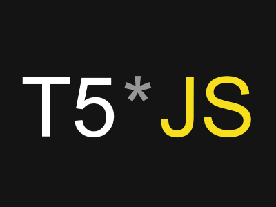
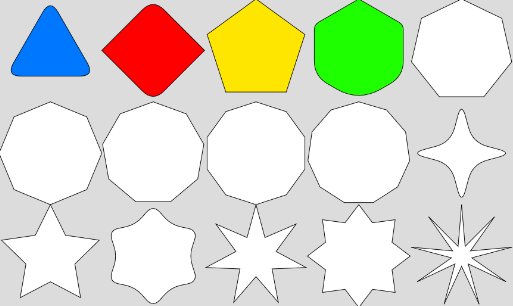
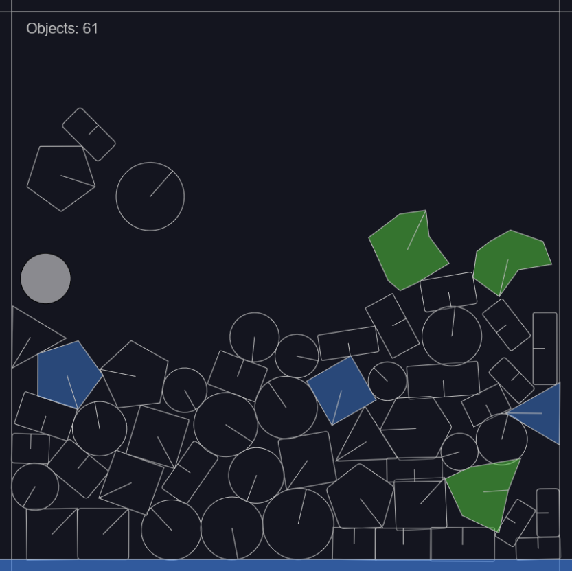

[](https://creativecommons.org/licenses/by-nc/4.0/)



# T5.js Documentation

## Important Note

**T5JS** is a personal project for experimentation and learning. It is subject to change, and backward compatibility may be an issue if used via a content delivery network (CDN). For a more stable experience, it is recommended to download and use your own version of **T5JS**.

## Overview

T5.js is a lightweight and simplified 2D graphics library designed for drawing on the canvas. Inspired by p5.js, T5.js uses similar function names for ease of use and familiarity, along with some new functions. It focuses on providing an intuitive API for creating and manipulating 2D graphics with minimal setup and overhead. 

T5.js does not use any code from p5.js and is not affiliated with it. p5.js has some functionalities such as WEBGL that T5.js does not yet have. If you're looking for a library with more functionalities, in a larger package, check out [p5.js](https://github.com/processing/p5.js/tree/main).

In addition to T5.js, I'm also a developer on [Q5.js](https://github.com/quinton-ashley/q5.js). Q5.js serves as a robust alternative for those looking for a lightweight yet powerful alternative to p5.js.

## Features
- Easy-to-use API similar to p5.js
- Built-in dimension agnostic option with flexibleCanvas()
- Optimized for performance
- Modular design allowing for easy extension and customization
- Additional custom functions
  

## Getting Started

### Installation

The quickest way to start using T5.js is with the aijs.io browser-based code editor.

Follow [this link](https://aijs.io/editor?user=AIJS&project=t5.js-Template) to open the template in a browser-based code editor. Then, simply press the play button to see your sketch in action.


You can Use T5.js via cdn.

```html
    <script src="https://cdn.jsdelivr.net/gh/Tezumie/T5.js@latest/T5Main.js"></script>
```

For production it is recommended to download T5Main.js and use the actual file to ensure no future compatability issues.

```html
<!DOCTYPE html>
<html lang="en">
    <head>
        <meta charset="UTF-8" />
        <meta name="viewport" content="width=device-width, initial-scale=1.0" />
        <title>T5</title>
        <link rel="stylesheet" type="text/css" href="style.css" />
        <script src="T5Main.js"></script>
    </head>
    <body>
        <main></main>
        <script src="sketch.js"></script>
    </body>
</html>

```
You can use `<script src="T5Main.js"></script>` to access all of the available features.

Optionally, you can select which features you want and omit all the others. Individual libraries can be found in the T5 folder.


T5 is now compatible with p5 Sound.

```html
    <script src="https://cdnjs.cloudflare.com/ajax/libs/p5.js/1.10.0/addons/p5.sound.min.js"></script>
```
### Basic Setup

Here's a simple example to get you started with T5.js:

```js
let aspectRatio = 3 / 4;

function setup() {
  createCanvas(window.innerWidth, window.innerWidth / aspectRatio);
  flexibleCanvas(1000);// Makes your project Dimension Agnostic
}

function draw() {
  background(220);
  rect(0, 0, 500)
}
```
### Custom functions

T5.js handles some functionalities different than p5, but almost all p5 drawing functionalities are the same.

There are also some T5.js specific functions such as `borderRadius()`, `noiseEllipse()`,  `gradientFill()`, `polygon()` and more! look in the examples folder to see how some of them work.

For more details, see the [documentation](examples/customFunctions.md).



### Instances

In t5js, an instance contains all the properties and methods for a t5 sketch. Each instance has an optional `preload()`, `setup()` and `draw()` function, similar to a regular global sketch.

Here’s an example:

```javascript
let sketch = new T5();

sketch.setup = function() {
    sketch.createCanvas(window.innerWidth, window.innerHeight);
};

sketch.draw = function() {
    sketch.background(255);
};

```

### Physics



The T5.js physics add on is still in development, but you can already use it for simple experiments. There is demo project in the examples folder.

T5.js physics is powered by [matter-js](https://brm.io/matter-js/)

To Use physics you will have to include Matter-js in your project dependencies, by either downloading it or via cdn;

```html
  <script src="https://cdnjs.cloudflare.com/ajax/libs/matter-js/0.20.0/matter.min.js"></script>
```

### Contributing

We welcome contributions to T5.js! If you have suggestions, bug reports, or would like to contribute code, please open an issue or submit a pull request on GitHub.

Alternatively, reach out on Discord or join our community: https://discord.com/invite/eW7MbvXZbY

### In Development

-//********************************-T5Webgl-********************************//
-//********************************-T5Shaders-********************************//
-//********************************-T5Physics-********************************//
-//********************************-T5Svg-********************************//

### License

T5.js is released under the CC BY-NC license License. See the LICENSE file for details.

You can use, modify, and include T5 in any project you make or sell, but you can't sell T5 itself.

-NonCommercial: You can use T5 for non-commercial purposes only. You can’t sell the T5 library itself, but you can use it as part of your applications, which you can sell.

-Attribution: You must give appropriate credit, provide a link to the license, and indicate if changes were made.

Attribution is already included at the top of the library.

```
/*!
 * © 2024 Tezumie-aijs.io
 * Licensed under CC BY-NC 4.0
 * https://creativecommons.org/licenses/by-nc/4.0/
 */

 ```

### Support

To support this project, please consider [becoming a patron](https://www.patreon.com/aijscodeeditor).


